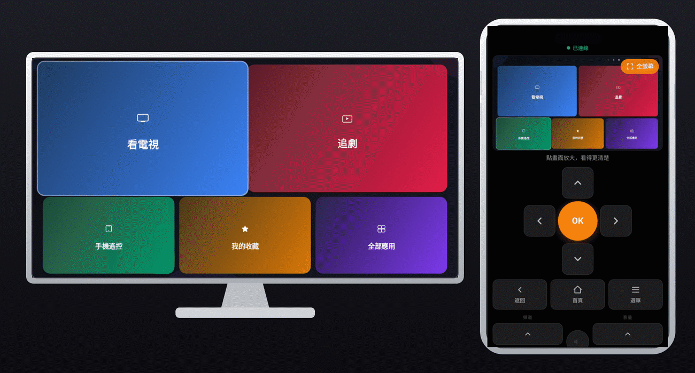
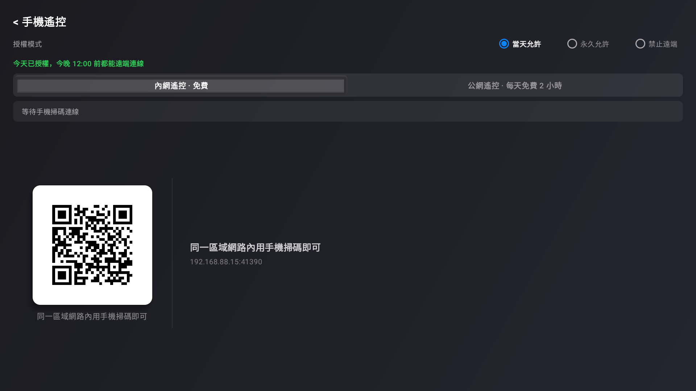
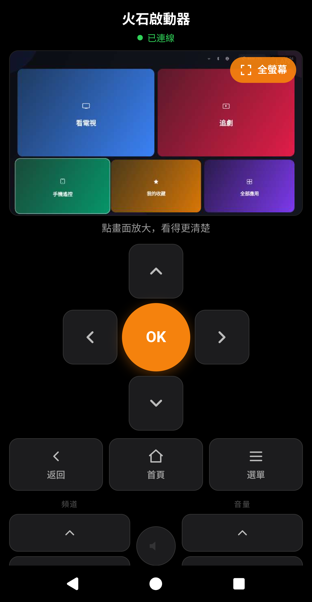
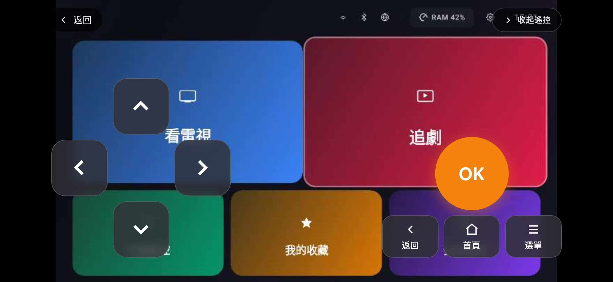
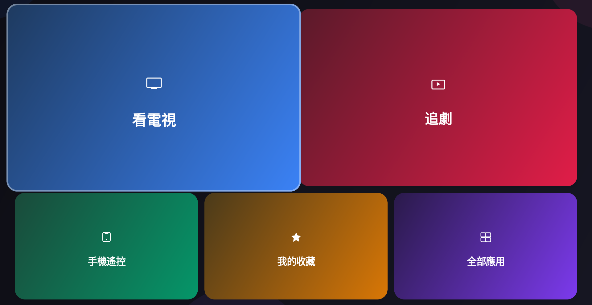
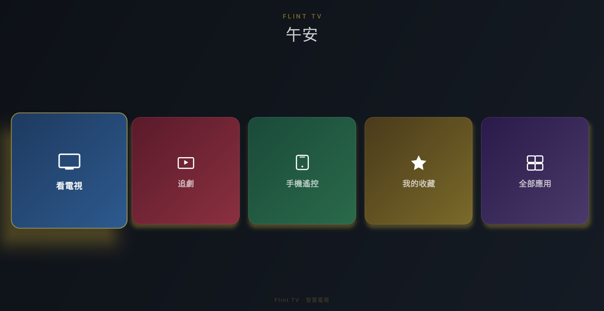
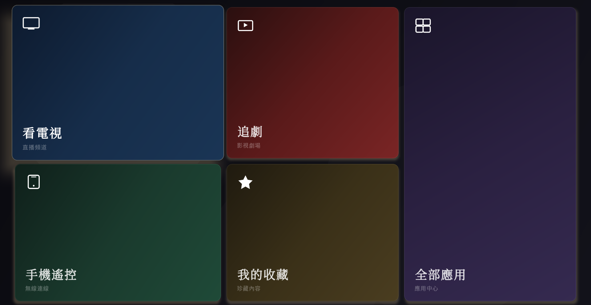
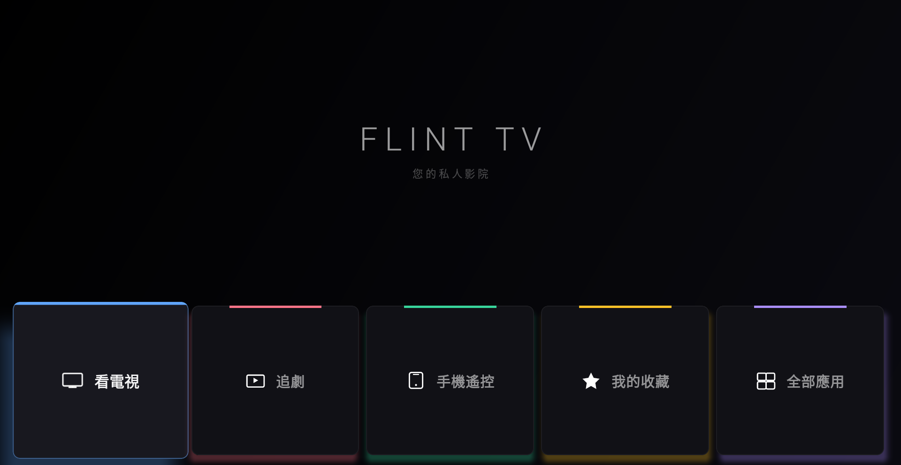

# 📺 火石 TV 遠端遙控啟動器 —— 免越獄 / 免 Root，手機跨網控制電視，幫長輩打字搜劇！

本項目核心將手機與電視跨網連動，完美適配 **安博盒子 (Unblock Tech)**、**小雲盒子 (Svicloud)**、**易播盒子 (EVPAD)**、**愛米盒子 (Imeety Box)** 等 Android 6.0+ 老舊電視盒子。

全系列開箱即用，免越獄、不需 Root 權限。本項目完全開源透明，全鏈路多級 SSL 安全加密，絕無任何商業廣告、無背景暗刷流量行為，提供最堅實的安全信任背書。

<!-- 🌟 頂部核心功能高光循環 GIF 演示區 🌟 -->

---

## 🚀 📺 5秒電視端極速安裝指南（最先看這裡）

為了方便老人與長輩獨立操作，本專案提供兩種最簡單的安裝方式：

* 🌐 **方式一（電視端直刷）：** 如果長輩正坐在電視機前，請直接打開電視盒子內建的瀏覽器，在網址列輸入極速短網址 ➡️ **`51999.uk`** 即可一鍵自動下載並觸發安裝！
* 💾 **方式二（隨身碟/U盤安裝）：** 晚輩亦可在電腦或手機上下載本專案的最新發行版 APK，拷貝至隨身碟（U盤）後插入電視盒子直接安裝。

> 💡 *安全透明說明：本短網址託管於 Cloudflare 智慧分流。電視端訪問將**安全跳轉至本專案 GitHub Release 官方託管直鏈**下載安全無毒的原生 APK 包；手機/電腦端訪問將引導至詳細圖文官網（Notion 頁面） [🔎]。*

---

## ✨ 核心功能與介面細節 (Screenshots)

### 1. 📱 三端聯動遠端遙控與打字搜尋
晚輩無需安裝任何軟體，只需用手機瀏覽器掃描電視端的配對碼，即可在手機上直接即時看到電視畫面並同步遙控。在辦公室也能幫家裡的爸媽快速打字搜尋想看的戲劇（支援直式與橫式介面深度優化）。

| 🔑 TV 端配對碼介面（公網遠端碼） | 📱 手機遠端操作（直式） | 📲 手機遠端操作（橫式） |
| :---: | :---: | :---: |
|  |  |  |

### 2. 👴 4 大適老簡潔大主題
專為銀髮族定制的高對比大字主題，支持遙控器焦點快速切換，長輩開機一秒看懂，再也不怕找不到 App。

| 🍎 Apple TV 風格 | 🏨 豪華飯店風格 | 🎨 水墨風格 | 🎬 電影院風格 |
| :---: | :---: | :---: | :---: |
|  |  |  |  |

---

## 🔒 安全性與隱私防禦

* **軍工級加密：** 全鏈路多級 SSL 安全加密，確保遠端控管數據傳輸不被劫持。
* **絕對控制權：** 隱私完全掌握在長輩手中，電視端設有【主動關閉遠端】實體開關，隨時一鍵切斷外部連線。
* **設備隱私安全：** 您的設備 ID（遠端碼）為您專屬的遠端操控憑證，**請注意切勿任意分享給其他人**。

---

## ❤️ 用技術做公益：愛心解鎖聲明

本啟動器本地功能完全免費。為了維持中轉伺服器的營運成本，公網遠端遙控功能每日限制 2 小時免費使用。

**如何快速解鎖永久無限版？**
1. **愛心不經我手：** 請向您**當地的任意兒童福利機構 / 孤兒院 / 弱勢扶助團體**捐助任意金額（金額不限，一塊錢也是善心）。
2. **發送憑證至工作信箱：** 請將您的捐款發票、收據照片或截圖，發送至工作電子郵件：📨 **`mail@51999.uk`**
3. **程式秒級自動解鎖：** 本信箱已全面接入 **AI 自動化審核系統**。系統識別到收據照片後，會自動為您完成遠端解鎖。

> 📌 **發信規範提示（有助於系統秒速識別）：**
> * **郵件主旨：** 請填寫 `火石TV愛心解鎖 + 您的設備ID`（設備 ID 即為您在電視端看到的公網遠端碼）
> * **郵件附件：** 請務必夾帶清晰的捐款發票或收據截圖（支援 JPG / PNG / PDF 格式）
> * **其他需求：** 若有其他定製化需求，亦可直接發送郵件至本工作信箱，系統會自動轉交人工處理。商業合作與批量授權請來信洽談。

---

## ⚖️ 授權與版權聲明 (License & Credits)

* 本專案部分 UI 導航與架構衍生自 [FlintLauncher](https://github.com)，感謝原作者在開源社群的貢獻。
* 本專案採用 **[Apache License 2.0](LICENSE)** 授權開源。
